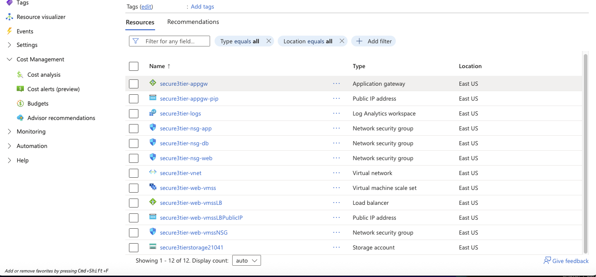
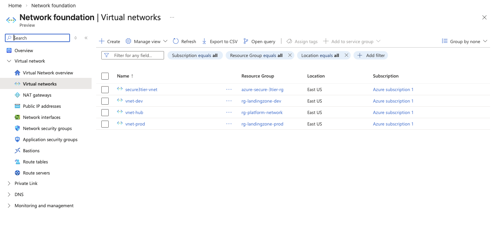
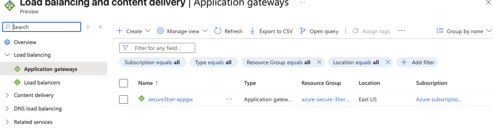
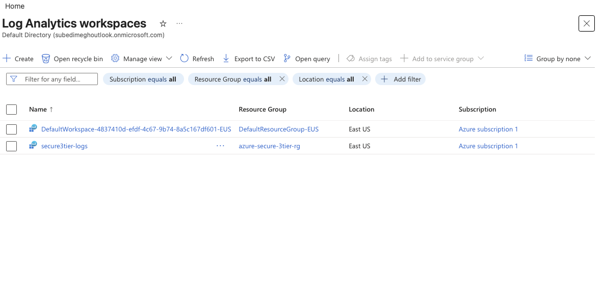
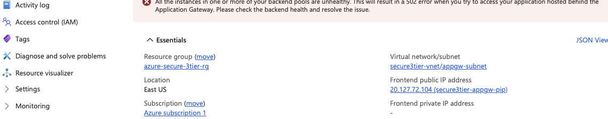
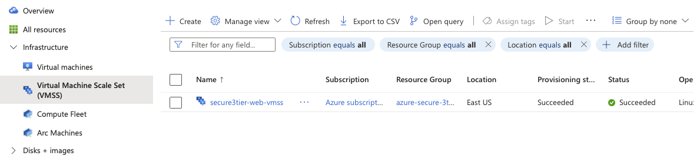

# Azure Secure 3-Tier Architecture


This project demonstrates the design and deployment of a **secure and scalable 3-Tier architecture in Microsoft Azure** using core cloud infrastructure services.

The architecture uses **Application Gateway, Virtual Machine Scale Sets, Virtual Networks, Network Security Groups, Azure Monitor, and Log Analytics** to build a production-style cloud environment.

---
## Architecture Diagram

```
                    Internet
                        │
                Public IP Address
                        │
            Azure Application Gateway
                        │
              VM Scale Set (Web Tier)
                        │
                 Azure Virtual Network
        ┌───────────────┼───────────────┐
     Web Subnet      App Subnet       DB Subnet
                        │
                 Azure Monitor
                        │
           Log Analytics Workspace
                        │
               Azure Storage Account
```


# Architecture Overview

This architecture separates the infrastructure into multiple layers to improve **security, scalability, and monitoring visibility**.

### Traffic Flow

Internet  
↓  
Application Gateway (Layer-7 Load Balancer)  
↓  
Virtual Machine Scale Set (Web Tier)  
↓  
Virtual Network Segmentation  
↓  
Monitoring via Azure Monitor & Log Analytics  

---

# Architecture Components

## Networking Layer

- Azure Virtual Network (VNet)
- Subnet segmentation

Subnets created:

- Web Subnet
- App Subnet
- Database Subnet
- Application Gateway Subnet

This structure separates application tiers and improves security boundaries.

---

## Security Layer

Network Security Groups (NSGs) control inbound and outbound traffic.

Security configuration includes:

- Subnet-level access control
- Port filtering
- Controlled internet access to the web tier

---

## Load Balancing Layer

Azure Application Gateway provides:

- Layer-7 load balancing
- HTTP/HTTPS routing
- Public IP frontend
- Backend pool routing to VM instances

---

## Compute Layer

Virtual Machine Scale Sets (VMSS) provide scalable compute resources.

Features demonstrated:

- Automated instance deployment
- Horizontal scaling capability
- Integration with Azure networking

---

## Monitoring Layer

Monitoring is implemented using:

- Azure Monitor
- Log Analytics Workspace

Application Gateway diagnostic logs are streamed into Log Analytics for centralized monitoring.

---

## Storage Layer

Azure Storage Account provides scalable storage services including:

- Blob storage
- File shares
- Application data storage
- Log archival

---

# Screenshots

## Resource Group Overview


---

## Virtual Network Subnets


---

## Application Gateway Configuration


---

## Log Analytics Workspace


---

## Monitoring Enabled


---

## Virtual Machine Scale Set


---

# Skills Demonstrated

Cloud Architecture Design  
Azure Networking  
Secure Subnet Segmentation  
Load Balancing Architecture  
Infrastructure Monitoring  
Infrastructure-as-Code Concepts  
Cloud Security Principles  

---

# Tools Used

Microsoft Azure Portal  
Azure CLI  
GitHub  
Azure Monitor  
Log Analytics  

---

# Key Learning Outcomes

Designing a multi-tier cloud architecture

Implementing secure subnet segmentation

Deploying scalable infrastructure using VM Scale Sets

Integrating centralized monitoring and diagnostics

Building production-style cloud infrastructure

---

# Author

# Author
Hari Sharma  
GitHub: https://github.com/hsharma-cloud
